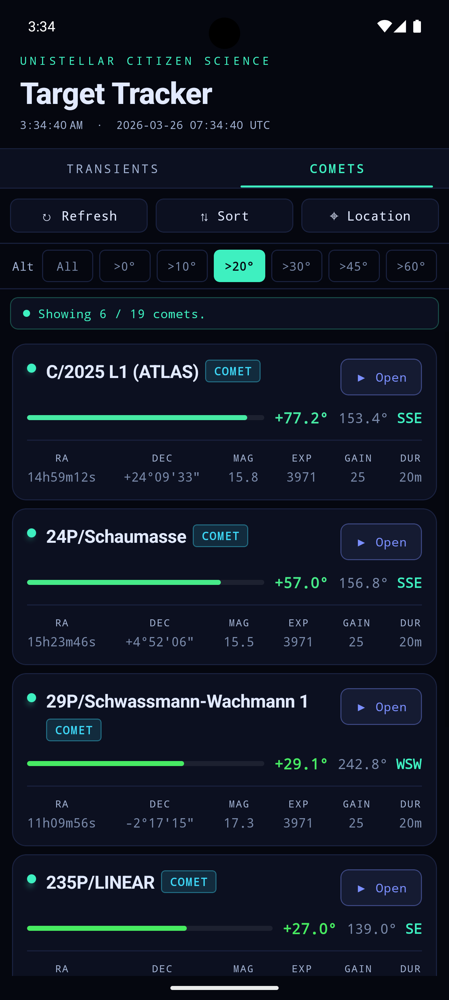
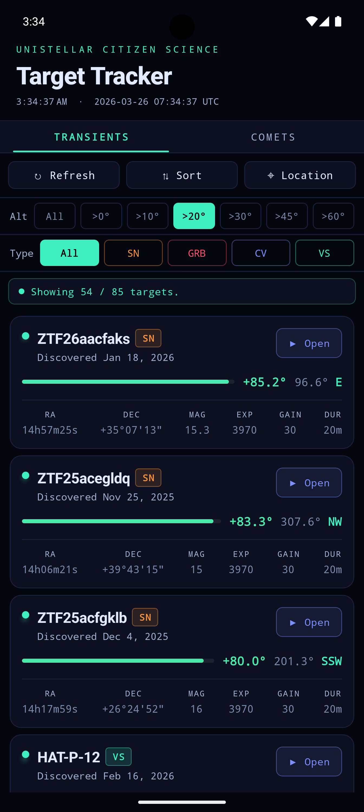

# eVHelper Target Tracker 

Real-time altitude/azimuth calculator for Unistellar citizen science targets. Developed with the help of Claude Code.

## Features
- **Live data** for Transients and Comets from Unistellar's Science Site
- **Ephemerides** from JPL Horizons
- **GPS location** via device location services
- **Sort** by altitude (up/down), azimuth, name, magnitude, or discovery date
- **Filter** by altitude and object type
- **▶ Open** deeplinks launch directly into the Unistellar app
- **Pull to refresh** reloads the target list and recomputes alt/az coordinates
- **Universal React Native App** — works on iPhone, iPad, and Android

## Screenshots
<p>
   
   
</p>

## Prerequisites
Install [Homebrew](https://brew.sh) if you don't have it, then:

```bash
brew install node watchman
npm install
```

### iOS

1. **Xcode** (v15+) from the Mac App Store
2. **Xcode Command Line Tools**
   ```bash
   xcode-select --install
   ```
3. **CocoaPods**
   ```bash
   brew install cocoapods
   cd ios && pod install && cd ..
   ```
4. **Configure signing** (one-time)
   - Open `ios/eVHelper.xcworkspace` in Xcode
   - Click the **eVHelper** project → **eVHelper** target → **Signing & Capabilities**
   - Select your Apple ID team (add via Xcode → Settings → Accounts → + if missing)
   - Set a unique **Bundle Identifier**, e.g. `com.yourname.evhelper`
5. **Pair device and enable Developer Mode** (one-time, physical device only)
   - Connect your iPhone via USB and trust the computer when prompted
   - In Xcode → Window → Devices and Simulators, wait for the device to finish provisioning
   - On the device: Settings → Privacy & Security → Developer Mode → enable, then restart
   - After restart, trust the app when prompted: Settings → General → VPN & Device Management → your Apple ID → Trust

### Android

1. **Android Studio** (Panda or later) — https://developer.android.com/studio
   - During first-time setup, install the **Android SDK**, **Android SDK Platform**, and **Android Virtual Device** components
   - To add components later: **Tools > SDK Manager**
2. **Set `ANDROID_HOME`** in your environment to the Android SDK location, and add `platform-tools` and `emulator` to your `PATH`. See the [React Native environment setup guide](https://reactnative.dev/docs/set-up-your-environment) for platform-specific instructions.
3. **Set up a device** (one-time)

   **Emulator:** Android Studio → View → Tool Windows → Device Manager → + → create and launch a Virtual Device

   **Physical device:**
   - Settings → About Phone → tap *Build Number* 7 times to enable Developer Options
   - Developer Options → enable USB Debugging
   - Connect via USB and accept the debugging prompt

---

## Running the App

### Install on a Device or Simulator

Builds the app and installs it on a connected device.

```bash
npm run ios -- --mode Release --no-packager # for ios
npm run android -- --mode release --no-packager # for android
```

### Development

Uses a local Metro bundler for fast refresh.

```bash
npm run ios # for ios
npm run android # for android
```
